# ActivityIQ — Architecture

> A technical reference for the full ActivityIQ platform: how the three components are structured, how they communicate, and how data flows end to end.

---

## Table of Contents

1. [System Overview](#1-system-overview)
2. [Component Map](#2-component-map)
3. [Frontend — Web Dashboard](#3-frontend--web-dashboard)
4. [Backend — API Server](#4-backend--api-server)
5. [Desktop Agent — Electron Tracker](#5-desktop-agent--electron-tracker)
6. [Database Schema](#6-database-schema)
7. [Authentication & Security](#7-authentication--security)
8. [Real-Time Communication](#8-real-time-communication)
9. [AI & Analytics Pipeline](#9-ai--analytics-pipeline)
10. [Data Flow Diagrams](#10-data-flow-diagrams)
11. [Key Design Decisions](#11-key-design-decisions)

---

## 1. System Overview

ActivityIQ is a **three-tier workforce analytics platform** composed of:

| Layer | Technology | Purpose |
|---|---|---|
| **Web Dashboard** | React 19 + Vite | Manager & employee views, reporting, analytics |
| **API Server** | Node.js + Express + Socket.IO | REST API, real-time events, business logic |
| **Desktop Agent** | Electron + active-win | Tracks foreground app/URL, captures screenshots |
| **Database** | MySQL 8 | Relational persistence; screenshots stored as `LONGBLOB` |

All three components live in a **monorepo**:

```
ActivityIQ/
├── src/          ← Web Dashboard (React/Vite)
├── server/       ← Backend API (Express)
├── agent/        ← Desktop Agent (Electron)
├── package.json  ← Shared scripts
└── vite.config.ts
```

---

## 2. Component Map

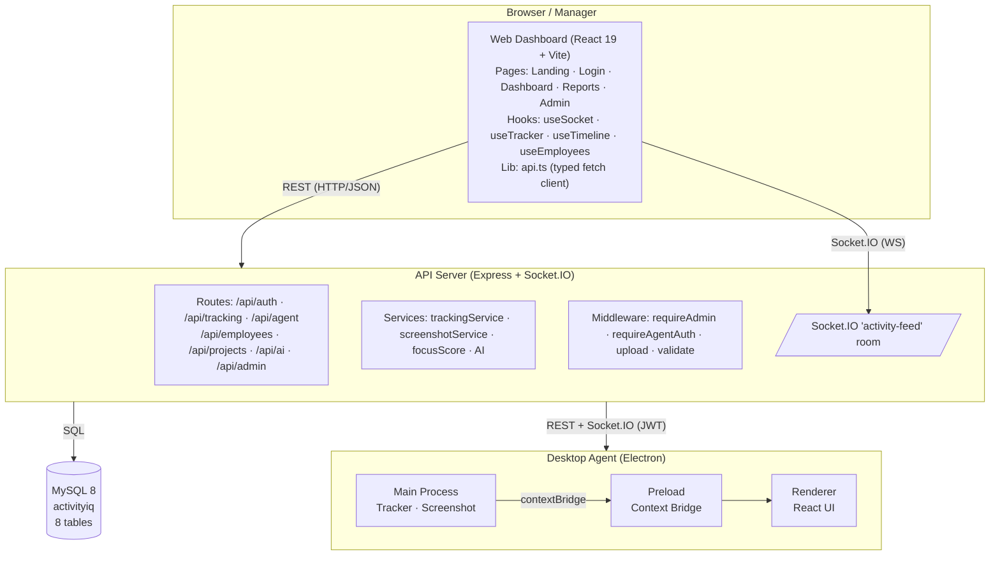

---

## 3. Frontend — Web Dashboard

### 3.1 Tech Stack

| Concern | Library |
|---|---|
| Framework | React 19 |
| Bundler | Vite |
| Styling | Tailwind CSS v4 + glassmorphism tokens |
| Animations | Framer Motion |
| Icons | Lucide React |
| Charts | Recharts |
| Real-time | Socket.IO Client |

### 3.2 Page Routing

`App.tsx` uses React Router and gates routes behind auth state:

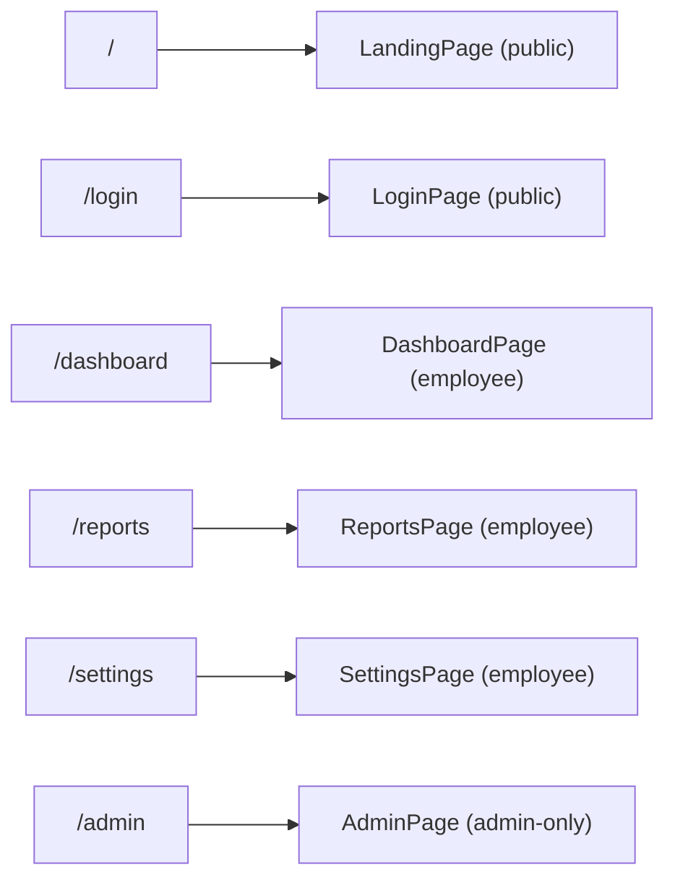

### 3.3 Directory Structure

```
src/
├── App.tsx                  # Router, auth guard, global providers
├── main.tsx                 # React root mount
├── index.css                # Design tokens, Tailwind layers
├── lib/
│   └── api.ts               # Typed fetch wrapper — all API calls live here
├── hooks/
│   ├── useSocket.ts         # Socket.IO connection lifecycle
│   ├── useTracker.ts        # Start/stop tracking state machine
│   ├── useTimeline.ts       # Timeline + screenshot data fetching
│   ├── useEmployees.ts      # Employee list with live status updates
│   └── useTheme.ts          # Dark/light mode toggle
├── pages/
│   ├── LandingPage.tsx
│   ├── LoginPage.tsx
│   ├── DashboardPage.tsx
│   ├── ReportsPage.tsx
│   ├── SettingsPage.tsx
│   └── AdminPage.tsx        # Shell — renders active admin sub-view
└── components/
    ├── admin/               # All Admin Panel tab views
    ├── dashboard/           # Dashboard-specific widgets
    ├── layout/              # Sidebar, Topbar
    ├── marketing/           # Landing page sections
    ├── tracker/             # TrackerWidget floating control
    └── ui/                  # Reusable primitives (Button, Modal…)
```

### 3.4 API Client (`src/lib/api.ts`)

All network calls are centralised in a single typed `api` object. It wraps the native `fetch` API and throws `ApiError` on non-OK responses.

Key interfaces exported:

| Interface | Description |
|---|---|
| `ApiUser` | Authenticated user identity |
| `ApiEmployee` | Employee record with live status |
| `ApiProject` | Project with name and colour |
| `ApiTimeEntry` | A single tracking session |
| `TimelineResponse` | Activity samples + app/URL stats + screenshots |
| `AiSummaryResponse` | Heuristic AI summary + focus score |

### 3.5 Real-Time Socket Integration

`useSocket.ts` establishes a Socket.IO connection using **cookie auth** (same HTTP-only cookie issued on login). The hook exposes the socket instance and subscribes to events like `activity_update` and `employee_status_change`, which are emitted by the server whenever the Desktop Agent posts a new sample.

---

## 4. Backend — API Server

### 4.1 Tech Stack

| Concern | Library |
|---|---|
| Runtime | Node.js (ESM, `--experimental-vm-modules`) |
| Framework | Express 5 |
| Database driver | mysql2 (promise pool) |
| Real-time | Socket.IO |
| Auth | HTTP-only session cookies + JWT (agents) |
| Validation | Zod |
| File uploads | Multer (memory storage, 10 MB limit) |
| OCR (optional) | Tesseract.js |

### 4.2 Server Entry Point (`server/index.ts`)

On startup the server:
1. Reads `server/schema.sql` and applies every statement idempotently (`IF NOT EXISTS`).
2. Mounts all route modules.
3. Attaches Socket.IO via `initSockets()`.
4. Listens on `PORT` (default `4000`).

### 4.3 Route Modules

| Module | Prefix | Responsibility |
|---|---|---|
| `auth.ts` | `/api/auth` | Login, signup, logout, session, agent pairing code generation |
| `agent.ts` | `/api/agent` | Desktop agent pairing & JWT issuance, activity sample ingestion |
| `tracking.ts` | `/api/tracking` | Start/stop session, timeline query |
| `employees.ts` | `/api/employees` | Employee CRUD |
| `projects.ts` | `/api/projects` | Project CRUD |
| `screenshots.ts` | `/api/screenshots` | Upload (multipart), stream by ID |
| `ai.ts` | `/api/ai` | Per-employee & company AI summary |
| `admin.ts` | `/api/admin` | All admin-only aggregation endpoints |

### 4.4 Middleware

| File | Purpose |
|---|---|
| `requireAdmin.ts` | Reads session cookie, checks `users.is_admin`; 403 if not admin |
| `requireAgentAuth.ts` | Verifies the agent Bearer JWT; 401 if invalid |
| `upload.ts` | Multer memory storage, 10 MB size limit |
| `validate.ts` | Zod schema validation helper — throws 400 with field errors |

### 4.5 Services

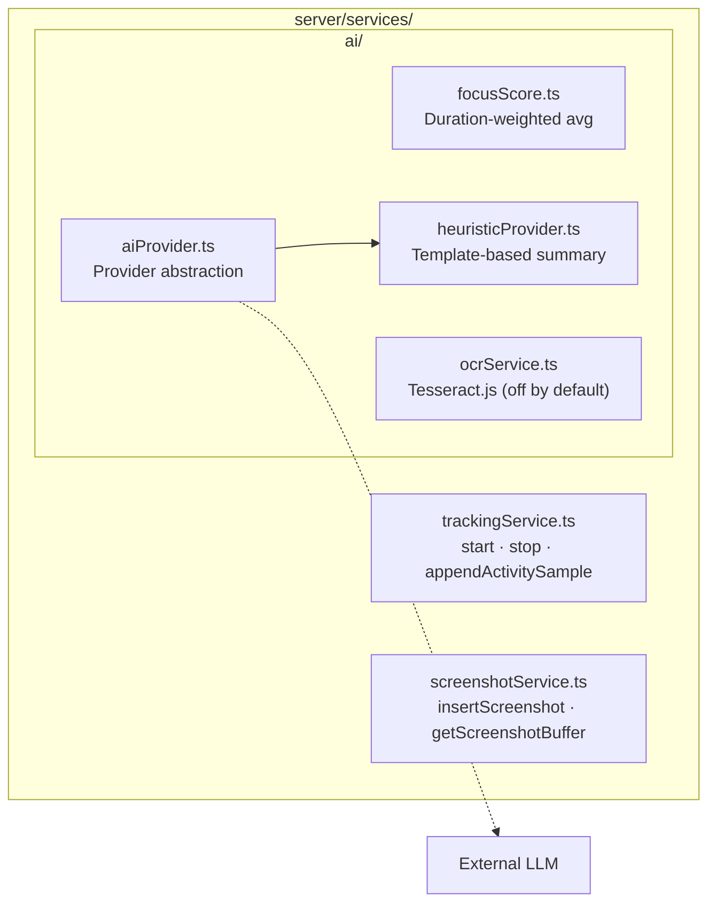

### 4.6 Database Layer (`server/db.ts`)

- Maintains a `mysql2` **connection pool** sized by `DB_POOL_SIZE`.
- Exposes three typed helpers: `get<T>()`, `all<T>()`, `run()`.
- `newId()` generates application-side IDs (no AUTO_INCREMENT).
- Schema is applied from `server/schema.sql` on every boot — fully idempotent.

---

## 5. Desktop Agent — Electron Tracker

### 5.1 Tech Stack

| Concern | Library |
|---|---|
| Shell | Electron |
| Bundler | electron-vite |
| UI | React (renderer process) |
| Activity capture | active-win |
| IPC | Electron `contextBridge` (preload) |

### 5.2 Process Architecture

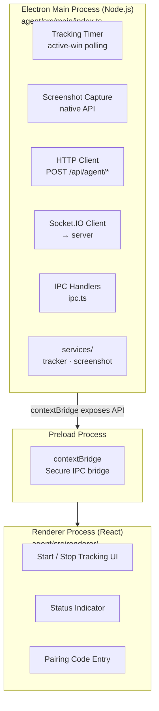

### 5.3 Agent Pairing Flow

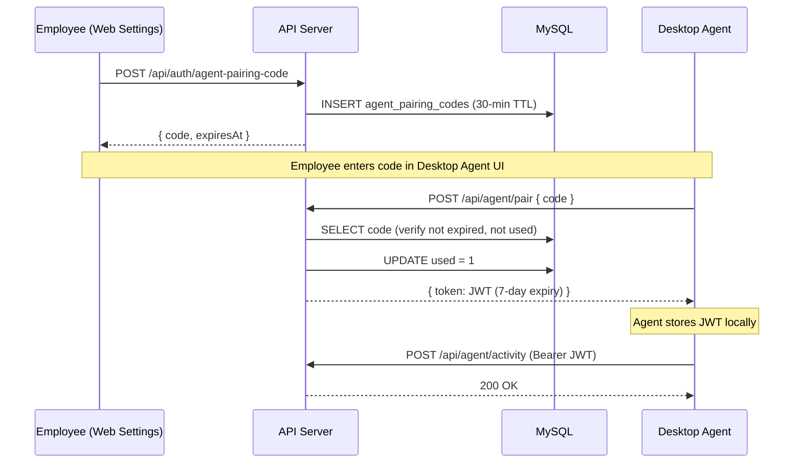

### 5.4 Tracking Loop

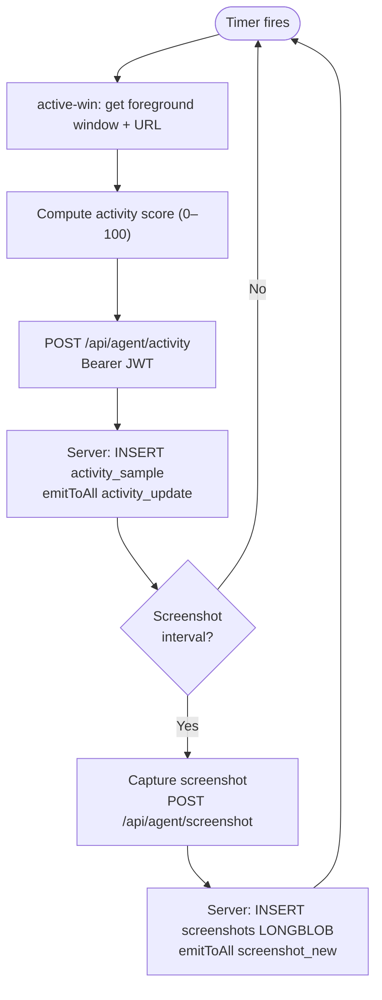

---

## 6. Database Schema

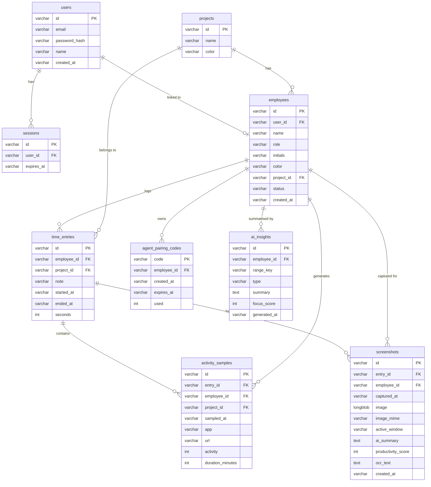

> **Note:** All primary keys are application-generated strings (`newId()`), not `AUTO_INCREMENT`. Timestamps are ISO-8601 `VARCHAR` columns so that lexicographic ordering works for range filters.

> **Note:** Screenshot binary data is stored directly in MySQL as `LONGBLOB`. No files are written to disk. The `GET /api/screenshots/:id` endpoint streams the blob with the correct `Content-Type` from the `image_mime` column.

---

## 7. Authentication & Security

### 7.1 Web User Auth (Cookie Sessions)

```mermaid
sequenceDiagram
    participant C as Client (Browser)
    participant S as API Server
    participant DB as MySQL

    C->>S: POST /api/auth/login { email, password }
    S->>DB: SELECT users WHERE email = ?
    S->>S: bcrypt.compare(password, hash)
    S->>DB: INSERT sessions (24h TTL)
    S-->>C: Set-Cookie: session_id=<id>; HttpOnly; SameSite=Strict

    Note over C,S: Subsequent protected requests

    C->>S: GET /api/... (Cookie: session_id=<id>)
    S->>DB: SELECT sessions WHERE id = ? AND expires_at > now
    S-->>C: 200 + data
```

### 7.2 Role System

| Role | How granted | Access |
|---|---|---|
| **Admin** | `users.is_admin = 1` OR email matches `ADMIN_EMAIL` env var | All routes including `/api/admin/*` |
| **Employee** | All authenticated users | Own data only |

The `requireAdmin` middleware enforces the admin gate. It is applied to every `/api/admin/*` route and to any other write operations that should be admin-only.

### 7.3 Desktop Agent Auth (JWT)

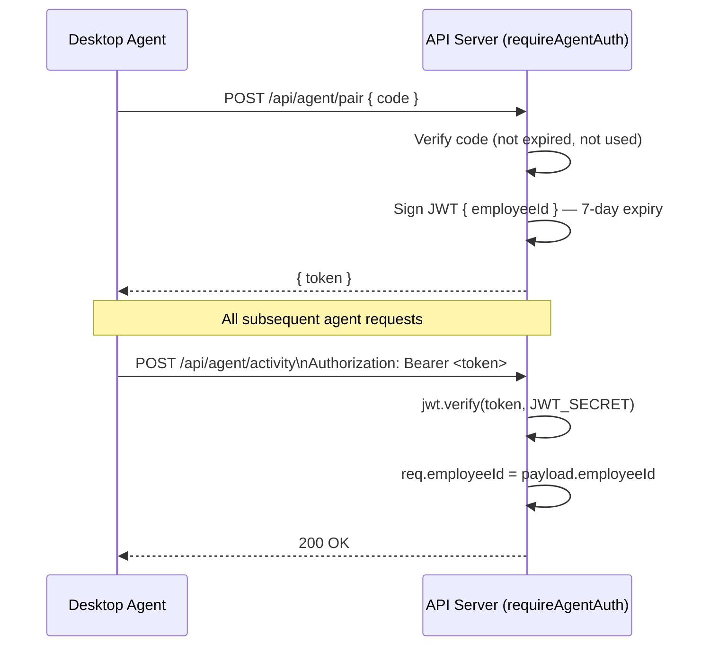

### 7.4 Socket.IO Auth

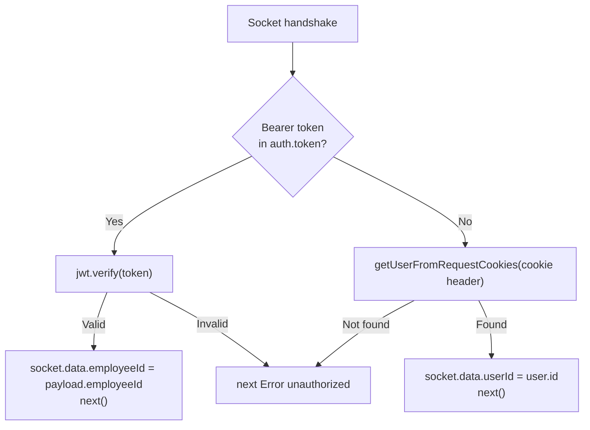

---

## 8. Real-Time Communication

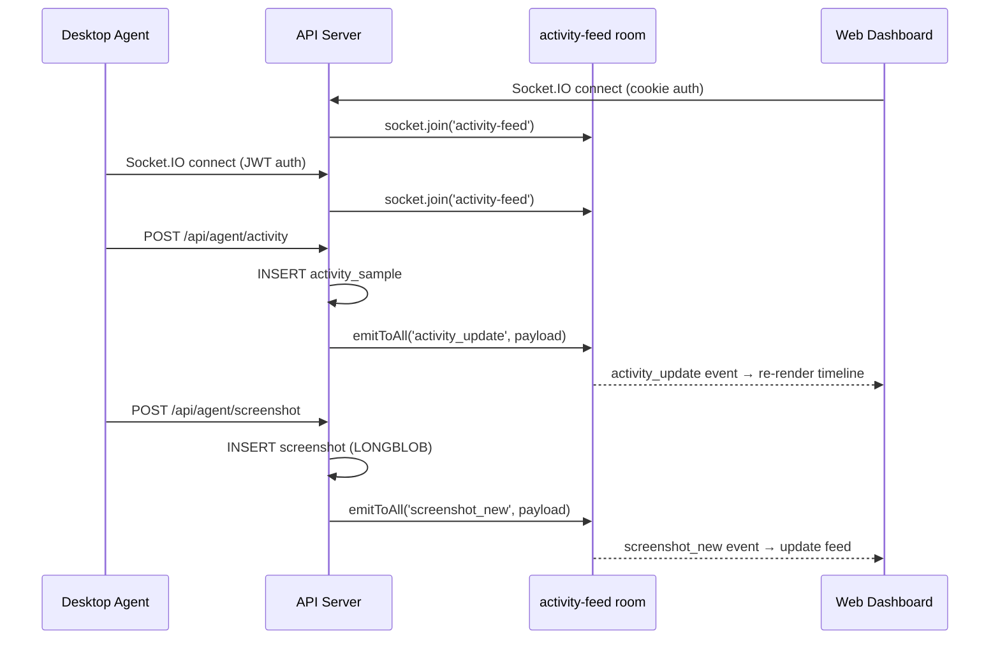

- All connected clients (both agents and dashboards) join a single **`activity-feed`** Socket.IO room.
- `emitToAll()` broadcasts to that room — no per-user rooms are needed for the current feature set.

---

## 9. AI & Analytics Pipeline

### 9.1 Focus Score

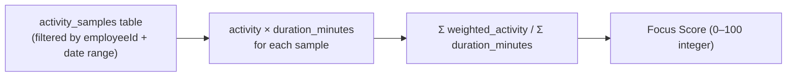

Computed entirely server-side from raw data — no external API required.

### 9.2 Heuristic AI Summaries

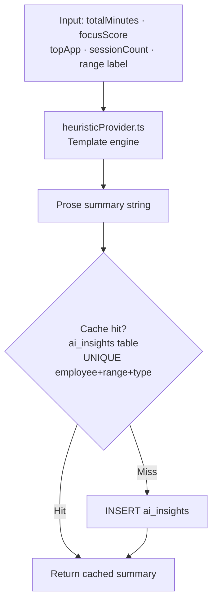

### 9.3 OCR (Tesseract.js)

Disabled by default. Enable with `OCR_ENABLED=true` in `.env`.

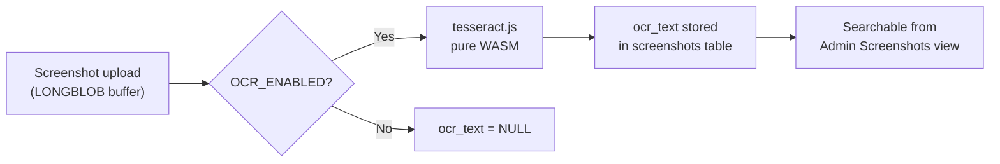

### 9.4 AI Provider Abstraction

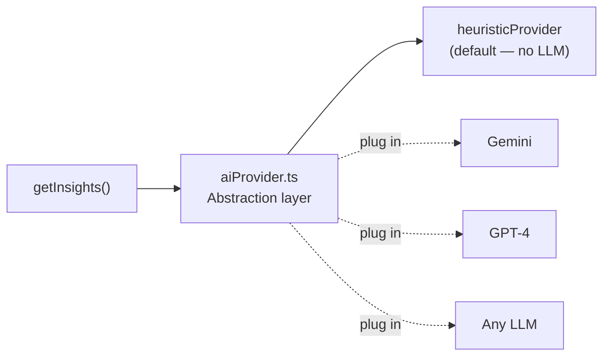

---

## 10. Data Flow Diagrams

### 10.1 Tracking Session Lifecycle

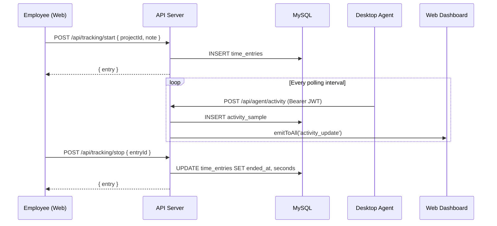

### 10.2 Admin Analytics Query

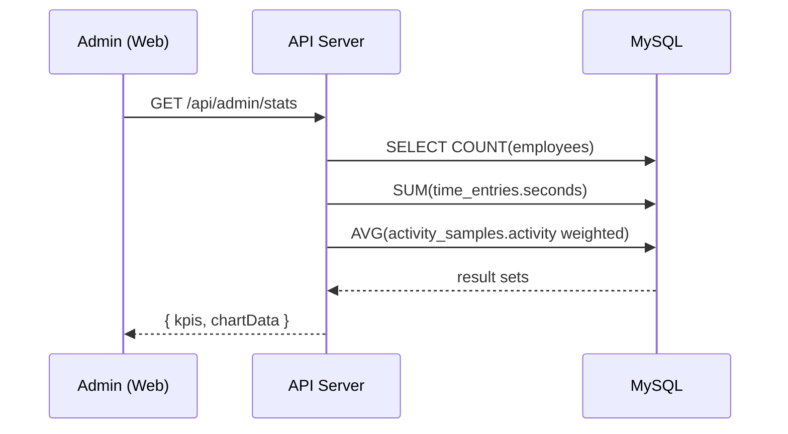

---

## 11. Key Design Decisions

| Decision | Rationale |
|---|---|
| **MySQL `LONGBLOB` for screenshots** | Simplifies deployment (no object storage needed), keeps referential integrity, avoids orphaned files. Tradeoff: large DB size at scale. |
| **ISO-8601 `VARCHAR` timestamps** | Enables lexicographic range filters (`>=`, `<`) without date-type parsing complexity. Matches the original SQLite schema. |
| **Application-generated IDs** | `newId()` produces UUIDs/nanoids before insert, allowing the server to return IDs immediately without a round-trip `LAST_INSERT_ID()`. |
| **Heuristic AI (no LLM by default)** | Zero external API cost and latency for the default install. The `aiProvider.ts` abstraction makes it easy to plug in a real LLM. |
| **Single Socket.IO room (`activity-feed`)** | Simpler broadcast semantics for MVP. Dashboards filter relevant events client-side by `employeeId`. |
| **Dual auth on Socket.IO** | Agents use Bearer JWT; dashboards use cookies. The middleware handles both transparently so a single socket server serves both client types. |
| **Monorepo with separate `agent/` package** | The Electron agent has its own `package.json` and build pipeline (`electron-vite`, `electron-builder`) to avoid bundling Electron into the web build. |
| **Schema auto-applied on boot** | Eliminates a manual migration step during development. Every `CREATE TABLE IF NOT EXISTS` statement is idempotent, so re-running on an existing DB is safe. |
