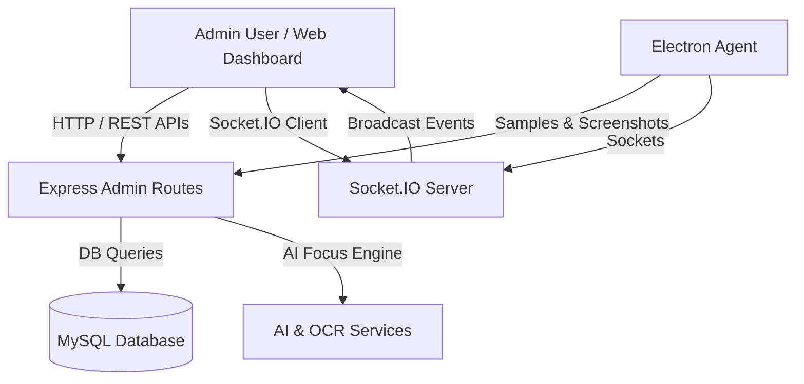

# Production-Ready Admin Panel for ActivityIQ

This document details the implementation plan for adding a comprehensive, production-ready **Admin Panel** to the ActivityIQ platform. The admin panel integrates deeply with the existing Express backend, MySQL database, Socket.IO real-time engine, AI scoring service, and React 19 + Tailwind CSS frontend.

---

## Architecture Overview

---

## Key Features & Capabilities

1. **Admin Authentication & Role-Based Access Control (RBAC)**:
   - Extend `users` table schema with `is_admin` column.
   - `requireAdmin` backend middleware for API protection.
   - Seamless role switching & Admin badge in the UI.

2. **Overview Dashboard**:
   - Company-wide metrics: Total employees, live active users, total hours logged (today/week/month), average productivity score, estimated idle time.
   - Real-time activity pulse and interactive analytics charts (Recharts).

3. **Real-time Monitoring**:
   - Live activity grid powered by Socket.IO events (`tracking:started`, `tracking:stopped`, `activity:sample`, `screenshot:new`).
   - Live application & website tracking feed, active window titles, and duration counters.

4. **Employee Management**:
   - Paginated, searchable, and filterable data table (by role, project, online status).
   - Column sorting (name, tracked hours, focus score).
   - Create, edit, and deactivate employee modal forms.

5. **Employee Detail & Activity Timeline**:
   - Deep-dive drawer/view per employee showing active tracking sessions, visual timeline, app/URL breakdowns, screenshot history, and focus score trends.

6. **Project Management**:
   - Full CRUD for projects (name, color, description/budget).
   - Tracked hours per project, assigned team members, and activity breakdowns.

7. **Screenshot Monitoring**:
   - System-wide gallery with filters by employee, project, date range, and productivity level.
   - Full-text search across active window titles and OCR extracted text.
   - Lightbox modal with metadata, productivity score, OCR text, and AI summary.

8. **Productivity & Focus Analytics**:
   - Company-wide focus scoring analysis, peak productivity hours, active vs idle ratios, top productive vs unproductive apps/sites.

9. **AI Insights & Summaries**:
   - On-demand and periodic AI-generated company performance summaries.
   - Focus score distributions and actionable recommendations.

10. **Daily / Weekly / Monthly Reports**:
    - Customizable date range reporting.
    - Exportable CSV datasets for payroll, client billing, or performance audits.

11. **Admin & System Settings**:
    - Admin profile management, system tracking policies, screenshot capture intervals, and platform configurations.

